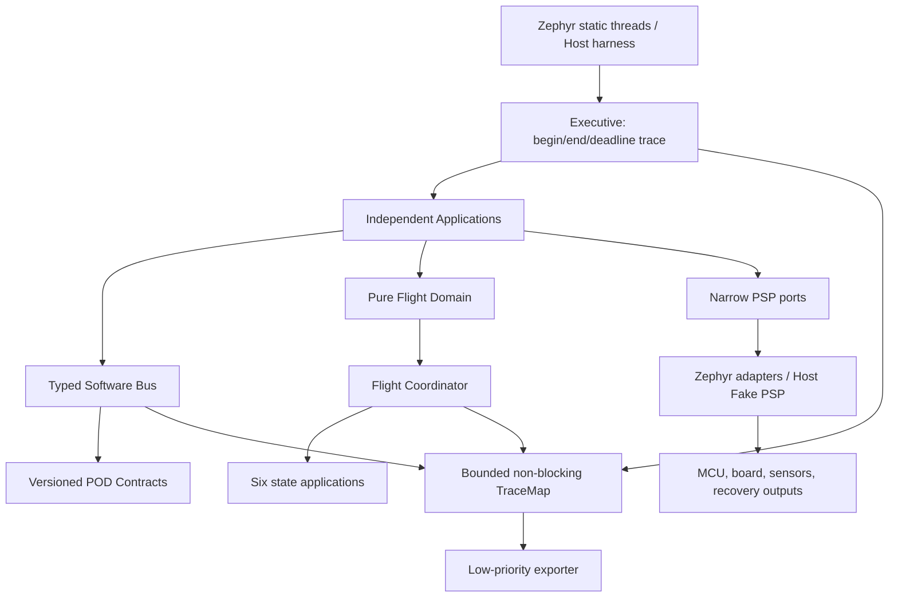

# NURA Zephyr 포팅 구현 기준서

문서 상태: 구현 기준, 2026-07-11

Zephyr 기준: `v3.7.2 LTS`

대상: `native_sim`, PJRC Teensy 4.1 (`teensy41`)

안전 상태: **벤치/구조 검증용. 하드웨어 검증 전 비행 금지.**

## 1. 설계 목적

이 구현은 다음 목적을 동시에 만족하도록 만든다.

1. 보드와 센서 교체가 비행 판단 로직까지 전파되지 않게 한다.
2. 새 기능을 독립 Application으로 추가하고 typed Software Bus로 연결한다.
3. 하나의 비중요 Application 실패나 logger 정체가 mission loop를 막지 않게 한다.
4. 동적 할당 없이 메모리와 큐 사용량을 빌드 시점에 제한한다.
5. 이관 시 고정한 FSM의 전이식, 임계값, fallback을 포팅 중 변경하지 않는다.
6. 텍스트 로그가 아니라 실행 순서, 시간, SB 통신, FSM 전이를 복원하는
   TraceMap을 기본 검증 수단으로 제공한다.

## 2. 실제 구현 구조



| 경로 | 책임 | 금지 사항 |
|---|---|---|
| `modules/contracts/` | topic schema, ID, 단위, 상태/event 형식 | Zephyr, board, driver include |
| `modules/config/` | App Catalog, period, deadline, priority, stack, state enable | mission threshold, board pin |
| `modules/domain/flight/` | 판단식, 전이 요청, 상태 앱 private scratch | SB, GPIO, Zephyr, logger 호출 |
| `modules/core/` | bounded SB, Executive, TraceMap | 센서별 정책, 비행 임계값 |
| `modules/apps/` | 입력 집계, Coordinator 실행, 출력 guard, recorder | 구체 GPIO/SPI/I2C 타입 |
| `modules/platform/` | MCU/보드/센서/output 포트 계약 | 비행 전이 판단 |
| `modules/platform/host/` | 결정론적 Fake PSP와 host sink | 비행 빌드 포함 |
| `firmware/zephyr/` | Zephyr thread, Kconfig, devicetree, adapter | 임계값 재정의 |

검사 규칙:

```bash
rg -n '#include[[:space:]]*[<"](zephyr/|Arduino|board_pinmap)' modules/domain
```

결과는 0건이어야 한다.

## 3. PSP 정의

PSP는 단일 거대 HAL class가 아니다. MCU, board, sensor, recovery output,
storage/trace sink를 하나의 **교체 가능한 플랫폼 패키지**로 묶되, 상위 Application은
자신에게 필요한 좁은 port만 받는다.

현재 port:

- `ILowGImu`, `IHighGImu`, `IBarometer`, `IMagnetometer`
- `IGnss`, `IPowerMonitor`, `ISafetyInput`
- `IRecoveryOutput`
- `ITraceSink`, `IEventSink`, `IWatchdog`
- `BoardCapabilities`

보드 교체 절차:

1. 새 Zephyr board target 또는 board overlay를 만든다.
2. RAM, Flash, TraceMap, queue 용량을 Kconfig profile로 정한다.
3. 각 hardware port adapter를 구현한다.
4. composition root인 `firmware/zephyr/src/main.cpp`에서 adapter만 교체한다.
5. Domain dependency 검사와 host replay를 변경 없이 통과시킨다.
6. sensor 단위 bench test, recovery safe-output test, 전체 HIL을 수행한다.

센서 교체 절차:

1. 기존 contract의 물리량과 단위가 같으면 해당 PSP adapter만 교체한다.
2. 축 방향, scale, calibration, filtering은 adapter/sensor Application에서 처리한다.
3. contract 변경이 필요하면 schema version과 consumer compatibility를 함께 변경한다.
4. 비행 판단에 쓰이는 값의 의미가 바뀌면 flight logic 변경으로 취급한다.

Pyro 2개를 3개로 늘리는 경우에는 `RecoveryChannel` contract와 recovery policy가
변하므로 상위 변경이 0은 아니다. 그러나 GPIO 번호, active polarity, driver API,
MCU port는 PSP/devicetree 안에 머문다.

## 4. FSM 분리

`FlightCoordinator`가 소유하는 것은 다음뿐이다.

- 현재 `FlightState`와 state-entered timestamp
- 전이 sequence와 전이 commit
- state별 Application enable mask
- command/abort의 state guard
- 상태 진입 시점 기록

독립 상태 Application:

| State | Application | 출력 |
|---|---|---|
| `ARMED` | `LaunchDetectorApp` | `LAUNCH` 전이 요청 |
| `LAUNCH` | `BurnoutDetectorApp` | `COAST` 전이 요청 |
| `COAST` | `ApogeeDetectorApp` | `APOGEE` 전이 요청, baro stuck latch |
| `APOGEE` | `DrogueSequenceApp` | drogue intent, `DROGUE` 전이 요청 |
| `DROGUE` | `MainDeployDetectorApp` | `DEPLOY` 전이 요청 |
| `DEPLOY` | `LandingSequenceApp` | main intent, `GROUND` 전이 요청 |

상태 Application은 SB나 GPIO를 직접 호출하지 않는다. 입력 snapshot을 받아
`DecisionTrace`, `TransitionRequest`, `ActuationIntent` 값만 반환한다. 따라서 각 앱은
Zephyr 없이 단위 시험할 수 있고, 한 앱의 scratch state가 다른 상태 앱과 공유되지
않는다.

상태별 실행 정책은 `modules/config/include/nura/config/runtime_profile.h`의
`kAppCatalog`가 단일 source다. `AppEnableSet`, Coordinator dispatch, Executive gate,
생성 문서 `runtime_app_catalog.generated.md`가 모두 이 Catalog를 사용한다. 미구현
Application은 enable mask에 포함하지 않는다.

## 5. Software Bus 정책

### 5.1 Latest snapshot

센서와 현재 상태는 newest-value semantics를 사용한다. `LatestTopic<T>`는 copy 중
data race를 막기 위해 single-attempt atomic guard를 쓰며 기다리지 않는다.
경합 시 publish/read는 `false`를 반환하고 contention counter와 `BUS_DROP` trace를
남긴다.

사용 대상:

- IMU, barometer, magnetometer, GNSS, power, health, safety
- coherent `FlightInputs`
- `FlightStatus`, `AppEnableSet`

모든 payload는 trivial/standard-layout value type이며 compile-time copy budget을
검사한다. 포인터를 publish하지 않으므로 lifetime, ownership, use-after-free가 없다.
Application에는 전체 Bus 대신 sensor publisher, input aggregation, coordinator,
recovery, recorder, supervisor용 capability interface만 주입한다.

### 5.2 Ordered queue

명령, 작동 의도, 상태 전이, 판단, sensor fault는 고정 SPSC queue를 사용한다.

- push/pop은 대기하지 않는다.
- full이면 drop counter와 high-water를 갱신한다.
- command queue는 ingress router 한 개만 producer가 되어야 한다.
- actuation queue drop은 mission app 실패로 승격한다.
- decision/event drop은 비행 판단을 바꾸지 않지만 검증 결함이므로 degraded로 기록한다.

### 5.3 Priority와 blocking

Zephyr thread 우선순위는 다음 정책으로 구성했다.

| Execution domain | Priority | 주기 | 책임 |
|---|---:|---:|---|
| recovery | preemptive 0 | 2 ms | actuation guard, physical ON/OFF |
| mission | preemptive 1 | 10 ms | input aggregation, FSM Coordinator |
| critical sensors | preemptive 2 | 10-50 ms | low/high-g, barometer, safety input |
| optional sensors | preemptive 3 | 50-100 ms | magnetometer, GNSS, power |
| supervisor | preemptive 4 | 50 ms | app health, queue health, watchdog policy |
| event recorder | preemptive 8 | 20 ms | decision/transition/fault export |
| trace exporter | preemptive 9 | 20 ms | TraceMap export |

각 sensor와 두 recorder는 독립 static thread/stack을 가진다. sensor port는 Catalog의
deadline 안에 반환해야 하며 blocking retry, sleep, logging을 수행할 수 없다.
mission 경로에는 filesystem, UART 출력, sleep, dynamic allocation이 없다. TraceMap
기록도 lock 획득을 기다리지 않고 drop-on-contention한다. Console/storage export는
낮은 우선순위 recorder thread에서만 수행한다.

## 6. Recovery 출력 안전 경계

packet parser나 command handler는 GPIO를 직접 켤 수 없다. 경로는 반드시 다음과 같다.

```text
command -> SB -> FlightCoordinator state guard -> ActuationIntent
        -> SB ordered queue -> RecoveryActuationApp guard -> PSP output
```

ON intent 승인 조건:

- 최신 `FlightStatus.state`가 intent의 `authorized_state`와 같다.
- 최신 transition sequence가 intent의 sequence와 같다.
- drogue는 `APOGEE`, main은 `DEPLOY`에서만 ON 가능하다.

OFF와 `ALL_OFF`는 stale state에서도 허용한다. PSP write 실패 시 즉시 `allOff()`를
best-effort 호출하고 Application 결과를 `FAILED`로 남긴다.

Teensy overlay는 기존 실행 pinmap을 다음처럼 옮겼다.

| Logical channel | Teensy pins | Devicetree aliases |
|---|---|---|
| Drogue/Pyro1 | D28, D29 | `nura-drogue-a`, `nura-drogue-b` |
| Main/Pyro2 | D35, D38 | `nura-main-a`, `nura-main-b` |

이 매핑은 cross-build 검증만 끝났으며 실제 voltage/active polarity/boot glitch 검증은
끝나지 않았다.

## 7. 실패 격리의 실제 범위

보장 가능한 것:

- bounded queue/ring으로 heap 고갈을 피한다.
- logger/trace export 정체가 mission을 block하지 않는다.
- optional sensor가 `UNAVAILABLE/NO_DATA/FAULT`를 명시적으로 반환한다.
- sensor 하나의 blocking/failure가 다른 sensor thread를 직접 정지시키지 않는다.
- task result, duration, deadline miss, SB drop을 독립적으로 관측한다.
- stale/wrong-state recovery ON intent를 거부한다.

보장하지 않는 것:

- 같은 address space의 임의 memory corruption 격리
- CPU lockup에서 software만으로 복구
- driver가 interrupt를 장시간 막는 경우의 격리
- 검증되지 않은 thread 강제 restart의 안전성
- 센서가 그럴듯한 오값을 내는 경우의 완전한 검출

critical corruption과 hang은 hardware watchdog reset과 safe boot policy가 필요하다.
watchdog, storage, radio adapter는 다음 hardware phase에서 연결해야 한다.

## 8. 메모리 설정

다음 값은 Domain literal이 아니라 Kconfig/compiler definition에서 온다.

- `CONFIG_NURA_TRACE_CAPACITY_RECORDS`
- `CONFIG_NURA_*_QUEUE_SLOTS`
- `CONFIG_NURA_TRACE_EXPORT_BATCH_RECORDS`
- Zephyr `CONFIG_SRAM_SIZE`, Flash/devicetree memory region

현재 profile:

| Target | TraceMap records | 목적 |
|---|---:|---|
| `native_sim` | 2048 | trace/replay 분석 |
| `teensy41` | 512 | 현재 링크 RAM budget |

2026-07-11 Teensy cross-build 결과:

- Flash: 90,688 bytes / 8 MiB
- linked RAM region: 81,664 bytes / 256 KiB
- ITCM/DTCM/OCRAM 추가 영역: 현재 미사용

이 수치는 실제 stack high-water와 flight logging buffer를 포함한 최종 값이 아니다.

## 9. 빌드와 검증

```bash
scripts/setup-zephyr.sh
scripts/build-zephyr.sh native_sim
scripts/build-zephyr.sh teensy41
scripts/validate-migration.sh
```

`native_sim` smoke:

```bash
timeout 3s build/zephyr/native_sim/zephyr/zephyr.exe
```

Host full replay와 TraceMap:

```bash
cmake -S . -B build/host -G Ninja
cmake --build build/host
ctest --test-dir build/host --output-on-failure
build/host/nura_host_sim build/host/traces/flight_trace.csv
python3 tools/tracemap_export.py build/host/traces/flight_trace.csv \
  --out-dir build/host/traces/report
```

현재 확인된 결과:

- host core/fault guard tests 통과
- new host full flight `INIT -> ... -> GROUND` 통과
- critical SB queue drop 0
- TraceMap sequence gap 0
- Zephyr `native_sim` build/boot 통과
- Zephyr `teensy41` cross-build 통과

## 10. 남은 비행 승인 gate

다음이 끝나기 전 `teensy41` 이미지는 비행 펌웨어가 아니다.

1. LSM6DSO32, H3LIS331DL, LIS3MDL, MPL3115A2, GNSS, power PSP adapter 구현
2. 기존 calibration/filter/axis mapping 동등성 replay
3. recovery GPIO boot default, polarity, continuity, battery inhibit bench test
4. SD/program flash flight recorder port와 power-loss test
5. SX1262 telemetry/uplink parser port와 command authorization test
6. task/hardware watchdog 및 reset reason persistence
7. stack high-water, WCET, SB contention, storage latency 실측
8. HIL full-flight replay와 pyro disconnected scope test
9. `1000 ms` pyro pulse의 output duration/current/thermal hardware qualification
