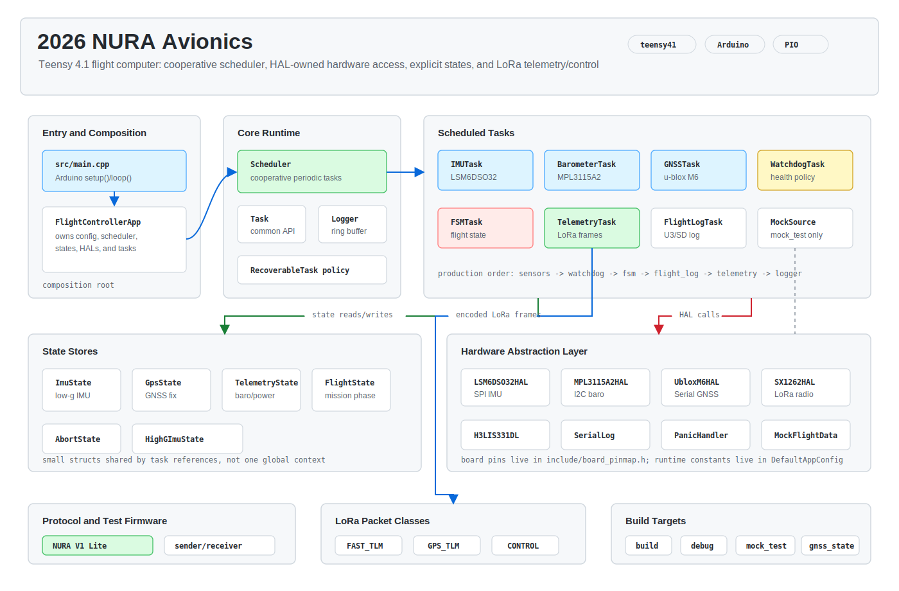

# 2026 NURA Avionics

Teensy 4.1 flight-computer firmware for the 2026 NURA rocket avionics stack.

The current codebase is built around a small cooperative scheduler, explicit state stores, hardware abstraction layers, and a lightweight LoRa telemetry/control protocol. It is still an active integration project: sensor acquisition, LoRa protocol work, mock telemetry, and ground-side receiver tests are in the repository, while flight rules, logging outputs, and final hardware validation are still being tightened.


## Architecture



Runtime flow:

1. `src/main.cpp` forwards Arduino `setup()` and `loop()` to `FlightControllerApp`.
2. `FlightControllerApp` owns config, state stores, HAL objects, mission tasks, sensor tasks, and the scheduler.
3. `Scheduler` runs fixed task objects cooperatively according to each task's `periodMs()`.
4. Sensor tasks update focused state structs.
5. Mission tasks consume those states for watchdog, FSM, telemetry, and logging behavior.
6. HAL classes are the only layer that should talk directly to board pins, buses, radios, and sensor libraries.

Production task order:

```text
IMUTask -> BarometerTask -> GNSSTask -> WatchdogTask -> FSMTask -> TelemetryTask -> LoggerTask
```

Mock telemetry task order:

```text
MockTelemetrySourceTask -> WatchdogTask -> FSMTask -> TelemetryTask -> LoggerTask
```

## Current Firmware Scope

- Board target: Teensy 4.1 with Arduino framework through PlatformIO.
- Low-g IMU path: `LSM6DSO32HAL` -> `IMUTask` -> `ImuState`.
- Barometer path: `MS5611HAL` -> `BarometerTask` -> `TelemetryState`.
- GNSS path: `UbloxM6GNSSHAL` -> `GNSSTask` -> `GpsState`.
- High-g IMU scaffold: `H3LIS331DLHAL`, `HighGImuTask`, and `HighGImuState` exist for integration.
- LoRa path: `Sx127xLoRaHAL` plus `TelemetryTask`.
- Protocol: fixed-length NURA V1 Lite frames in `protocol/include/nura_protocol_v1_lite.h`.
- Mock path: `MockFlightDataHAL` and `MockTelemetrySourceTask` feed deterministic telemetry for bench protocol tests.

Additional sensor HALs and sketches remain under `src/hal` and `sensor_test` for isolated hardware bring-up.

## LoRa Protocol

The active protocol is documented in `documents/nura_lora_packet_protocol_v1.md`.

V1 Lite keeps only three message classes:

| Message | Direction | Purpose |
| --- | --- | --- |
| `FAST_TLM` | avionics -> ground | high-rate pressure delta, low-g IMU, gyro, battery, status word |
| `GPS_TLM` | avionics -> ground | slower GNSS recovery/navigation telemetry |
| `CONTROL` | bidirectional | uplink commands and downlink ACK responses |

Nominal application rates:

```text
FAST_TLM: 5 Hz
GPS_TLM: 1 Hz
CONTROL: on demand, ACK has priority over telemetry
```

Flight radio defaults currently target SX1276-class 920 MHz operation. `NURA_DEV_SX1278` switches development builds toward the SX1278/Ra-01 433 MHz bench setup.

## Repository Layout

```text
src/app/        composition root and app configuration
src/core/       scheduler, task API, logger, recoverable-task policy
src/hal/        board, bus, sensor, radio, panic, and log-output adapters
src/sensors/    sensor acquisition tasks
src/missions/   FSM, watchdog, telemetry, logger, and mock source tasks
src/state/      small shared state stores
protocol/       shared NURA V1 Lite encoder/parser header
sender/         standalone avionics-side LoRa protocol test firmware
receiver/       standalone ground-side LoRa protocol test firmware and pair-test tool
sensor_test/    isolated hardware bring-up sketches and helper scripts
documents/      protocol, requirements, schedule exports, and architecture assets
test/           PlatformIO test sources
```

## PlatformIO Environments

| Environment | Purpose |
| --- | --- |
| `build` | normal Teensy 4.1 firmware build |
| `debug` | same firmware with verbose logging |
| `mock_test` | root firmware with mock telemetry and SX1278 bench radio flags |
| `gnss_state_test` | isolated GNSS state integration sketch |

Common commands:

```bash
pio run -e build
pio run -e debug
pio run -e mock_test
pio run -e gnss_state_test
```

Upload and monitor:

```bash
pio run -e build -t upload
pio device monitor -b 115200
```

Standalone sender/receiver builds:

```bash
pio run -d sender
pio run -d receiver
```

Two-board LoRa protocol test:

```bash
python3 receiver/tools/run_pair_test.py --duration 20
```

## Development Agreements

Use the shared schedule sheet as the source of truth for deadlines and team coordination. The current firmware direction follows these working agreements:

- Build each hardware path through `HAL -> Task -> State`, then integrate it into the flight app.
- Verify individual sensors with Arduino/PlatformIO sketches before relying on them in the flight controller.
- Keep LoRa as a lossy telemetry and control link, not as the primary raw-data recorder.
- Store high-rate raw flight data locally through future Flash/SD logging outputs.
- Validate changes through unit tests, mock tests, and full hardware tests before treating them as flight-ready.
- Keep the ground station decoder aligned with `protocol/include/nura_protocol_v1_lite.h`.

## Safety Notes

- `CONTROL` commands request actions; packet parsing must not directly energize actuators.
- Emergency recovery deployment must remain deduplicated, authenticated, ACKed, and routed through mission logic.
- Frequency, output power, antenna gain, duty cycle, and final channel plan must be checked against competition rules and Korean radio requirements before flight.
- The current code is integration firmware, not a completed flight-certified avionics release.
