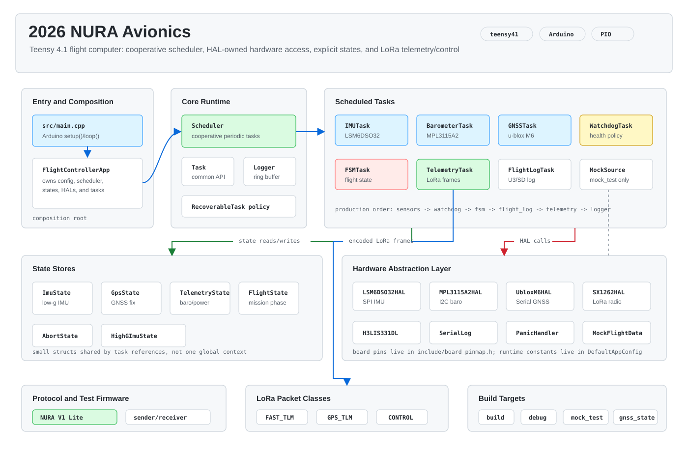

# 2026 NURA Avionics

Teensy 4.1 flight-computer firmware for the 2026 NURA rocket avionics stack.

The current codebase is built around a small cooperative scheduler, explicit state stores, hardware abstraction layers, and a lightweight LoRa telemetry/control protocol. It is still an active integration project: sensor acquisition, LoRa protocol work, mock telemetry, and ground-side receiver tests are in the repository, while flight rules, logging outputs, and final hardware validation are still being tightened.


## Architecture



Runtime flow:

1. `src/main.cpp` forwards Arduino `setup()` and `loop()` to `FlightControllerApp`.
2. `FlightControllerApp` owns config, state stores, HAL objects, mission tasks, sensor tasks, and the scheduler.
3. `Scheduler` runs fixed task objects cooperatively according to each task's `periodMs()`.
4. Sensor tasks update focused state structs.
5. Mission tasks consume those states for watchdog, FSM, telemetry, and logging behavior.
6. HAL classes are the only layer that should talk directly to board pins, buses, radios, and sensor libraries.

Production task order:

```text
IMUTask -> HighGImuTask -> MagnetometerTask -> BarometerTask -> GNSSTask -> WatchdogTask -> FSMTask -> FlightLogTask -> TelemetryTask -> LoggerTask
```

Mock telemetry task order:

```text
MockTelemetrySourceTask -> WatchdogTask -> FSMTask -> FlightLogTask -> TelemetryTask -> LoggerTask
```

## Current Firmware Scope

- Board target: Teensy 4.1 with Arduino framework through PlatformIO.
- Low-g IMU path: `LSM6DSO32HAL` -> `IMUTask` -> `ImuState`.
- Barometer path: `MPL3115A2HAL` -> `BarometerTask` -> `TelemetryState`.
- GNSS path: `UbloxM6GNSSHAL` -> `GNSSTask` -> `GpsState`.
- High-g IMU path: `H3LIS331DLHAL` -> `HighGImuTask` -> `HighGImuState`.
- Magnetometer path: `LIS3MDLHAL` -> `MagnetometerTask` -> `MagnetometerState`.
- LoRa path: `Sx127xLoRaHAL` plus `TelemetryTask`, targeting the SparkFun
  SPX-18572 / E19-915M30S SX1276 1 W breakout.
- Protocol: fixed-length authenticated NURA V2 Lite frames in `protocol/include/nura_protocol_v1_lite.h`.
- Flight logging: U3 program flash primary plus microSD mirror through `FlightLogTask`, with `.NLG` parsing tools under `log_parser/`.
- Mock path: `MockFlightDataHAL` and `MockTelemetrySourceTask` feed deterministic telemetry for bench protocol tests.

Additional sensor HALs and sketches remain under `src/hal` and `sensor_test` for isolated hardware bring-up.

## LoRa Protocol

The active protocol is documented in `documents/nura_lora_packet_protocol_v1.md`.

V2 Lite keeps only three message classes:

| Message | Direction | Purpose |
| --- | --- | --- |
| `FAST_TLM` | avionics -> ground | high-rate pressure delta, low-g IMU, gyro, battery, status word |
| `GPS_TLM` | avionics -> ground | slower GNSS recovery/navigation telemetry |
| `CONTROL` | bidirectional | uplink commands and downlink ACK responses |

Nominal application rates:

```text
FAST_TLM: 5 Hz
GPS_TLM: 1 Hz
CONTROL: on demand, ACK has priority over telemetry
```

Flight radio defaults currently target the SparkFun SX1276 1 W breakout at
920.9 MHz. `NURA_DEV_SX1278` switches development builds toward the legacy
SX1278/Ra-01 433 MHz bench setup.

## Repository Layout

```text
src/app/        composition root and app configuration
src/core/       scheduler, task API, logger, recoverable-task policy
src/hal/        board, bus, sensor, radio, panic, and log-output adapters
src/sensors/    sensor acquisition tasks
src/missions/   FSM, watchdog, telemetry, logger, and mock source tasks
src/state/      small shared state stores
protocol/       shared NURA V2 Lite authenticated frame codec header
log_parser/     host-side .NLG binary flight-log parser
sender/         standalone avionics-side LoRa protocol test firmware
receiver/       standalone ground-side LoRa protocol test firmware and pair-test tool
test/           embedded diagnostics, replay tests, and host-side checks
documents/      protocol, requirements, schedule exports, and architecture assets
```

## PlatformIO Environments

| Environment | Purpose |
| --- | --- |
| `main` | Teensy 4.1 firmware with the SX1276 breakout |
| `debug` | SX1276 breakout firmware with verbose logging |
| `debug_lora_autoflow` | bench-only SX1276 debug; automatic `SAFE -> ARMED -> LAUNCH`, then hold |
| `main_no_lora` | full application with the radio disabled |
| `debug_no_lora` | verbose application with the radio disabled |

Common commands:

```bash
pio run -e main
pio run -e debug
pio run -e debug_lora_autoflow
pio run -e main_no_lora
pio run -e debug_no_lora
```

`debug_lora_autoflow` is a bench-only build. It inherits the SparkFun
SPX-18572/E19-915M30S SX1276 path, limits the configured radio drive to 2 dBm,
and allows radio-init failure for wiring diagnostics. The FSM synthesizes
`SAFE -> ARMED -> LAUNCH` and then holds at `LAUNCH`; do not use it for flight
and do not connect pyro hardware.

Upload and monitor:

```bash
pio run -e build -t upload
pio device monitor -b 115200
```

The root PlatformIO environments use a custom Teensy upload command that retries
the loader after the common first soft-reboot write failure, so uploads should
work through the normal `pio run ... -t upload` path.

Standalone sender/receiver builds:

```bash
pio run -d sender
pio run -d receiver
```

Two-board LoRa protocol test:

```bash
python3 receiver/tools/run_pair_test.py --duration 20
```

## Development Agreements

Use the shared schedule sheet as the source of truth for deadlines and team coordination. The current firmware direction follows these working agreements:

- Build each hardware path through `HAL -> Task -> State`, then integrate it into the flight app.
- Verify individual sensors with Arduino/PlatformIO sketches before relying on them in the flight controller.
- Keep LoRa as a lossy telemetry and control link, not as the primary raw-data recorder.
- Store high-rate raw flight data locally through U3 program flash and the microSD mirror.
- Validate changes through unit tests, mock tests, and full hardware tests before treating them as flight-ready.
- Keep the ground station decoder aligned with `protocol/include/nura_protocol_v1_lite.h`.

## Safety Notes

- `CONTROL` commands request actions; packet parsing must not directly energize actuators.
- Emergency recovery deployment must remain deduplicated, authenticated, ACKed, and routed through mission logic.
- Frequency, output power, antenna gain, duty cycle, and final channel plan must be checked against competition rules and Korean radio requirements before flight.
- The current code is integration firmware, not a completed flight-certified avionics release.

## License

This project is licensed under the Apache License 2.0. Third-party libraries retain their own licenses.

This repository contains experimental avionics software and documentation. It is provided without warranty and must be independently reviewed, tested, and validated before any flight or safety-critical use.
